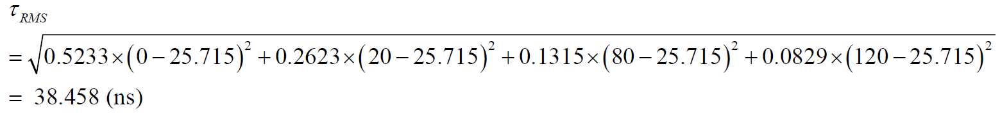
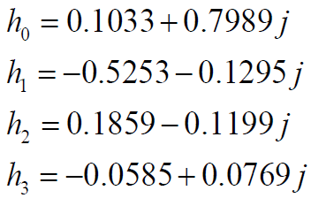
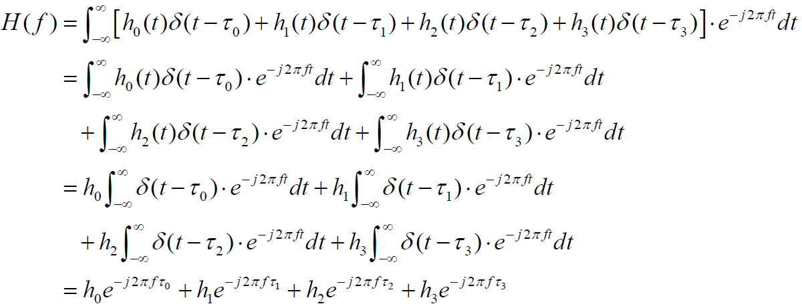
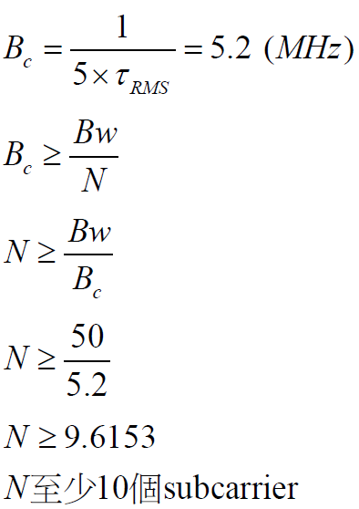

# Multipath_Simulation
Using Python to simulate multipath fading channel

## Channel power delay profile
| Tap          | Power(dB)     | Delay(τi)     |
|:------------:|:-------------:|:-------------:|
| 0            | 0             | 0 ns          |
| 1            | -3            | 20 ns         |
| 2            | -6            | 80 ns         |
| 3            | -8            | 120 ns        |

* (a) Please list the power ratio of 4 taps in linear scale

| Tap          | Power(dB)     | Power(Linear) | Power(Normalize) | Delay(τi)    |
|:------------:|:-------------:|:-------------:|:----------------:|:------------:|
| 0            | 0             | 1             | 0.5233           | 0 ns         |
| 1            | -3            | 0.5012        | 0.2623           | 20 ns        |
| 2            | -6            | 0.2512        | 0.1315           | 80 ns        |
| 3            | -8            | 0.1585        | 0.0829           | 120 ns       |

* (b) Max excess delay

    120 ns

* (c) Mean excess delay

* (d) RMS excess delay

## Channel

* (a) Channel impulse

* (b) Fourier transform

* (c) Channel frequency response

* (d) Subcarrier

